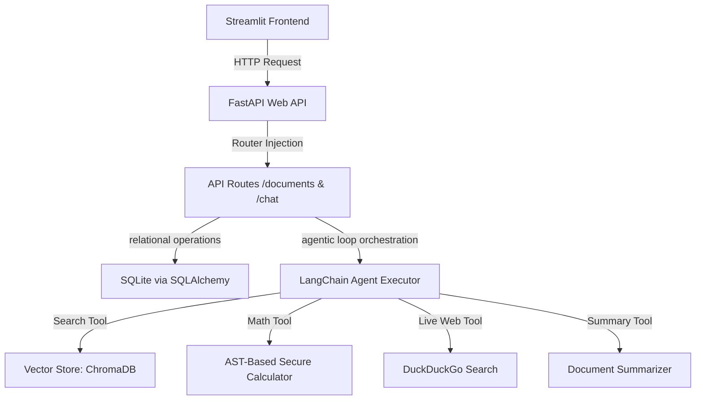

# Smart Document Assistant RAG Pipeline

A production-grade, containerized Retrieval-Augmented Generation (RAG) agentic QA assistant. This project combines a **FastAPI** backend, **Streamlit** frontend, **LangChain** agent orchestration, **ChromaDB** vector storage, and **SQLite** persistent chat history.

---

## 🛠️ Architecture & Features Overview

The application follows a modular, PEP 8 compliant, service-oriented architecture:



### Key Capabilities Built & Verified:
* **Interactive Frontend**: Rich Streamlit UI featuring a card-style chat input with an embedded model badge and action buttons (Summarize & Web Search) docked right next to the circular send button.
* **Persistent ChromaDB Vector Store**: Configured with a dedicated Docker volume mount (`CHROMA_PERSIST_DIR`) to prevent data/embedding loss when restarting the IDE or Docker containers.
* **Local & Cloud Model Switching**: Swap between Google Gemini cloud models and local Ollama models (e.g. `llama3.2:3b`) on-the-fly from the sidebar.
* **Session Management & Auto-Naming**: Generates readable chat session titles using the user's initial question and selected PDF filename. Supports reloading history, loading previous chats, and permanent deletion.
* **Sidebar Session Pagination**: Limits the displayed history to **5 sessions per page** with a navigation footer (`◀`, `X / Y`, `▶`) to keep the sidebar compact.
* **Ingested Document Registry**: Upload **PDF, TXT, or Markdown (.md)** files, view upload times in **Indian Standard Time (IST)**, toggle selections via "Select All" / "Clear All" for targeted RAG retrieval, and delete files permanently.
* **Token Usage Dashboard**: Real-time session token counter with a **Concise Mode** toggle to trim response lengths and save cloud costs.

---

## ⚙️ Design Decisions

### 1. Chunking Strategy (RecursiveCharacterTextSplitter)
- **Choice**: `RecursiveCharacterTextSplitter(chunk_size=1000, chunk_overlap=200)`.
- **Justification**: Using character-recursive splitting ensures semantic continuity across paragraph boundaries. A `200` character overlap guarantees context isn't lost at boundaries, preserving semantic coherence.

### 2. Embedding Model (all-MiniLM-L6-v2)
- **Choice**: `sentence-transformers/all-MiniLM-L6-v2` (384-dimensional).
- **Justification**: Offers a balance of execution speed and quality. By resolving local cache directories, it runs fully offline, bypassing network dependencies and protecting host VRAM/RAM constraints.

### 3. Retrieval Approach (ChromaDB + Metadata-Filtered Similarity Search)
- **Choice**: ChromaDB as the vector store, with `top_k=4` for factual queries (`search_documents`) and `top_k=8` for thematic summarisation (`summarize_document_topic`). Retrieval uses cosine similarity on 384-dimensional vectors with optional metadata pre-filtering by filename.
- **Why ChromaDB over FAISS or pgvector**: FAISS is a pure ANN library with no built-in persistence or metadata filtering — any filter logic would have to be written manually and applied as a slow post-retrieval pass. `pgvector` requires a running PostgreSQL server, which is unnecessary operational overhead for a local-first, single-node deployment. ChromaDB ships its own embedded persistence layer (backed by `hnswlib` + SQLite) and supports native `where={}` metadata filters, letting us restrict retrieval to a specific uploaded document with zero extra code.
- **Why two `top_k` values**: A narrow `top_k=4` keeps the LLM's context focused for precise fact lookups (e.g. a specific price or policy rule). A wider `top_k=8` gives the model enough breadth to synthesise a coherent topic-level summary across multiple sections. Using the same window for both tasks would either over-dilute factual answers or under-sample summaries.

### 4. Agent Framework (LangChain ReAct Tool-Calling Agent)
- **Choice**: `create_tool_calling_agent` + `AgentExecutor` from LangChain, with four registered tools: `search_documents`, `summarize_document_topic`, `web_search`, and `calculator`.
- **Why a ReAct agent over a simple sequential RAG chain**: A standard chain hardcodes the retrieval step — it always retrieves, always stuffs the same prompt, and produces a single answer. This breaks the moment a query requires more than one operation. For example, *"What is the base price of model X, and what is 12% of it?"* requires a document lookup **and** a calculation in sequence, where the output of the first step is the input to the second. The ReAct framework lets the LLM reason (*"I need to look up the price first"*), act (*call `search_documents`*), observe the result, then reason again (*"now I can calculate"*), act (*call `calculator`*), and synthesise a final answer — all without any hardcoded control flow.
- **Anti-hallucination layer**: The system prompt bakes in two constraints at construction time: (1) a strict citation mandate — the LLM **must** append the `(Source, Page)` metadata returned by the tool; (2) a hard refusal rule — if the tool returns no relevant results, the LLM **must** reply with *"I don't know"* rather than fabricating an answer. Numeric extraction guidelines also force the model to strip currency symbols and commas before passing values to the calculator, preventing silent arithmetic errors on Indian-formatted numbers like `₹31,54,000`.

---

## 🚀 Setup & Execution

### Option A: Running via Docker (Recommended - 1-Click Launch)

Ensure you have [Docker](https://www.docker.com/) and Docker Compose installed.

1. **Configure Environment Variables**:
   Create a `.env` file in the root directory:
   ```env
   GOOGLE_API_KEY=your_gemini_api_key_here
   ```

2. **Launch Services**:
   Run the following command:
   ```bash
   docker-compose up --build
   ```
   *(Note: The Dockerfile uses optimized layer caching. Base dependencies like PyTorch are isolated on their own layer, making incremental builds take under 10 seconds!)*

3. **Hot-Reloading (Docker Compose Watch)**:
   For local development with automatic file sync and live reloading, run:
   ```bash
   docker compose watch
   ```
   This watches your `./app` directory and syncs changes directly into the running containers, with Uvicorn and Streamlit dynamically reloading on save.

4. **Access Applications**:
   - **Streamlit Frontend**: [http://localhost:8501](http://localhost:8501)
   - **FastAPI API Documentation**: [http://localhost:8000/docs](http://localhost:8000/docs)

---

### Option B: Running Locally (Virtual Environment)

1. **Set Up Python Virtual Environment**:
   ```bash
   python -m venv .venv
   # Windows Activation
   .\.venv\Scripts\activate
   # Linux/MacOS Activation
   source .venv/bin/activate
   ```

2. **Install Dependencies**:
   ```bash
   pip install -r requirements.txt
   ```

3. **Configure Environment Variables**:
   Create a `.env` file in the root directory:
   ```env
   GOOGLE_API_KEY=your_gemini_api_key_here
   ```

4. **Run FastAPI Backend**:
   ```bash
   uvicorn app.main:app --host 127.0.0.1 --port 8000
   ```

5. **Run Streamlit Frontend** (in a new terminal):
   ```bash
   streamlit run app/frontend/app.py --server.port 8501
   ```

---

## 💬 Sample Data & Queries

Three sample documents and a full Q&A test set are included in [`sample_data/`](./sample_data/):

| File | Description |
|---|---|
| `NEXUS ENTERPRISE SOLUTIONS.pdf` | Fictional HR policy — leave allocations, maternity/paternity benefits, health insurance, internet allowances by band |
| `vertex_q2_financials.pdf` | Fictional Q2 2026 financial report — segment revenue, OPEX breakdown, hardware capital allocation |
| `datacore_ops_manual.pdf` | Fictional IT operations manual — incident severity SLAs, log retention policy, DR compute thresholds |
| `QA.md` | 33 verified Q&A pairs across all three documents (11 per document) — annotated by tool trigger |

### Example Queries (upload a sample document first, then try these)

1. **Multi-Step RAG + Calculation** *(triggers `search_documents` → `calculator`)*:
   > *"If a Lead Engineer opts to top up their health insurance plan for a full year, what is the total amount deducted from their payroll?"*
   Expected: Retrieves ₹1,950/month from the HR policy, multiplies by 12 → **₹23,400**

2. **Anti-Hallucination Guardrail** *(triggers `search_documents` → returns refusal)*:
   > *"Which specific public cloud provider does DataCore use to host its deep glacier cold vaults?"*
   Expected: *"The provided documents do not contain this information."*

3. **Live Web Search** *(triggers `web_search` via DuckDuckGo)*:
   > *"What is the current stock price of Apple Inc.?"*
   Expected: Recognises the question is outside uploaded documents; fetches live web results.

4. **Document Topic Summarisation** *(triggers `summarize_document_topic`)*:
   > *"Provide a detailed, structured summary of the Q2 financials document."*
   Expected: Broad synthesis across multiple sections with source citations.

5. **Cross-Section Calculation** *(triggers `search_documents` → `calculator`)*:
   > *"During a disaster recovery simulation, what is the maximum absolute number of CPUs that can be utilised including the elastic burst allowance?"*
   Expected: Retrieves baseline 400 CPUs + 35% elastic → **540 CPUs**

6. **Simple Factual Lookup** *(triggers `search_documents`)*:
   > *"How many weeks of fully paid maternity leave are female employees eligible for?"*
   Expected: **26 weeks**, cited to the Nexus HR policy.

> See [`sample_data/QA.md`](./sample_data/QA.md) for the full 33-pair verified test set, including expected tool triggers and exact answer strings for each query.

---

## ⚠️ Known Limitations

- **Single-collection vector store**: All uploaded documents share one ChromaDB collection (`smart_docs`). At very high document volumes, retrieval precision may degrade without more aggressive metadata filtering or per-user collection namespacing.
- **Synchronous ingestion on the API thread**: Document processing (PDF parsing, chunking, embedding) runs synchronously on the FastAPI thread pool. Uploading a very large document (100+ pages) will block that thread for several seconds. A background task queue (e.g. Celery or FastAPI `BackgroundTasks`) would be the correct fix.
- **Local embedding model cold-start**: The first request after a container restart incurs a 3–5 second delay while `all-MiniLM-L6-v2` loads into memory. Subsequent requests are fast.
- **SQLite write contention under concurrency**: SQLite's file-level locking means heavy concurrent usage (many simultaneous chat sessions writing history) will cause lock contention. This is acceptable for a single-user or small-team deployment but not for production multi-tenant scale.
- **DuckDuckGo web search reliability**: The HTML scraping approach is fragile — DuckDuckGo may change its markup or rate-limit the IP, causing the tool to silently fall back to the DDGS library. Neither method guarantees result quality.
- **No streaming responses**: The agent runs to completion before returning the full answer. Long multi-step reasoning chains (3+ tool calls) can take 10–20 seconds with no visual feedback in the Streamlit UI beyond a spinner.

---

## 🔭 What I Would Improve With More Time

1. **Streaming agent output**: Integrate LangChain's `astream_events` API with Streamlit's `st.write_stream` to stream tokens token-by-token, eliminating the waiting UX problem entirely.
2. **Async ingestion pipeline**: Move document processing to a `BackgroundTasks` queue or a lightweight Celery worker so large uploads return immediately with a job ID the frontend polls.
3. **Reranking layer**: Add a cross-encoder reranker (e.g. `ms-marco-MiniLM-L-6-v2`) between the vector retrieval step and the LLM context assembly step. This dramatically improves answer precision on ambiguous queries at a modest latency cost.
4. **Per-user / per-session document namespacing**: Partition ChromaDB collections by user ID so document isolation is enforced at the database level rather than relying solely on metadata filters.
5. **Migrate to PostgreSQL + pgvector**: Replace SQLite + ChromaDB with a single PostgreSQL instance using `pgvector`. This collapses two database technologies into one, enables transactional consistency across relational and vector writes, and removes the SQLite concurrency limitation.

---

## 🧪 Evaluation

An automated evaluation harness is included in [`eval/run_eval.py`](./eval/run_eval.py).
It runs **15 curated questions** (5 per sample document) against the live API and scores answers using keyword-based matching — no external judge or paid API required.

### How to run

1. **Start the backend** (Docker or local):
   ```bash
   docker-compose up
   # OR
   uvicorn app.main:app --host 127.0.0.1 --port 8000
   ```

2. **Upload the three sample documents** (via the Streamlit UI, or with curl):
   ```bash
   curl -X POST http://localhost:8000/documents/upload \
        -F "file=@sample_data/NEXUS ENTERPRISE SOLUTIONS.pdf"
   curl -X POST http://localhost:8000/documents/upload \
        -F "file=@sample_data/vertex_q2_financials.pdf"
   curl -X POST http://localhost:8000/documents/upload \
        -F "file=@sample_data/datacore_ops_manual.pdf"
   ```

3. **Run the eval script**:
   - **Option 1: Target locally from host machine** (requires `requests` package in your virtual environment):
     ```bash
     python eval/run_eval.py
     ```
   - **Option 2: Execute directly inside the running Docker container** (no local environment setup needed):
     ```bash
     docker-compose exec api python eval/run_eval.py
     ```

### What it measures

| Category | Questions | What is tested |
|---|---|---|
| `factual` | 8 | Direct document lookup — correct specific values |
| `calculation` | 4 | Multi-step `search_documents` → `calculator` chaining |
| `guardrail` | 3 | Anti-hallucination: agent must say "don't know" |

### Scoring

Each question has a list of **required keywords**. An answer **PASSES** if it contains at least one keyword (case-insensitive). The script prints a per-question verdict, a category breakdown, and an overall grade (🟢 ≥80% / 🟡 ≥60% / 🔴 <60%). Full results are saved to `eval/eval_results.json` (git-ignored).
