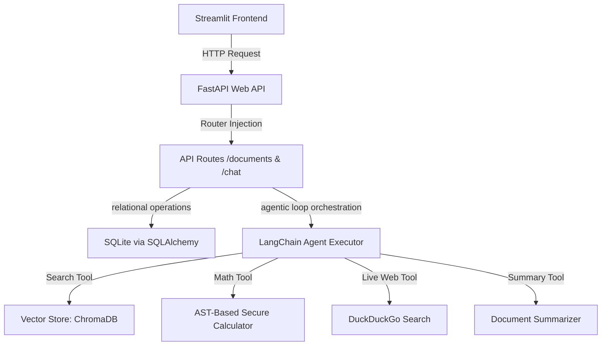

# Smart Document Assistant RAG Pipeline

A production-grade, containerized Retrieval-Augmented Generation (RAG) agentic QA assistant. This project combines a **FastAPI** backend, **Streamlit** frontend, **LangChain** agent orchestration, **ChromaDB** vector storage, and **SQLite** persistent chat history.

---

## 🛠️ Architecture & Features Overview

The application follows a modular, PEP 8 compliant, service-oriented architecture:



### Key Capabilities Built & Verified:
* **Interactive Frontend**: Rich Streamlit UI featuring a card-style chat input with an embedded model badge and action buttons (Summarize & Web Search) docked right next to the circular send button.
* **Persistent ChromaDB Vector Store**: Configured with a dedicated Docker volume mount (`CHROMA_PERSIST_DIR`) to prevent data/embedding loss when restarting the IDE or Docker containers.
* **Local & Cloud Model Switching**: Swap between Google Gemini cloud models and local Ollama models (e.g. `llama3.2:3b`) on-the-fly from the sidebar.
* **Session Management & Auto-Naming**: Generates readable chat session titles using the user's initial question and selected PDF filename. Supports reloading history, loading previous chats, and permanent deletion.
* **Sidebar Session Pagination**: Limits the displayed history to **5 sessions per page** with a navigation footer (`◀`, `X / Y`, `▶`) to keep the sidebar compact.
* **Ingested Document Registry**: Upload PDF or TXT files, view upload times in **Indian Standard Time (IST)**, toggle selections via "Select All" / "Clear All" for targeted RAG retrieval, and delete files permanently.
* **Token Usage Dashboard**: Real-time session token counter with a **Concise Mode** toggle to trim response lengths and save cloud costs.

---

## ⚙️ Design Decisions

### 1. Chunking Strategy (RecursiveCharacterTextSplitter)
- **Choice**: `RecursiveCharacterTextSplitter(chunk_size=1000, chunk_overlap=200)`.
- **Justification**: Using character-recursive splitting ensures semantic continuity across paragraph boundaries. A `200` character overlap guarantees context isn't lost at boundaries, preserving semantic coherence.

### 2. Embedding Model (all-MiniLM-L6-v2)
- **Choice**: `sentence-transformers/all-MiniLM-L6-v2` (384-dimensional).
- **Justification**: Offers a balance of execution speed and quality. By resolving local cache directories, it runs fully offline, bypassing network dependencies and protecting host VRAM/RAM constraints.

### 3. Agent Framework & Math Guardrails
- **Choice**: LangChain Tool-Calling Agent (`create_tool_calling_agent`).
- **Justification**: ReAct architectures allow the model to reason about what tools to invoke. We implemented strict numeric extraction guidelines in the system prompt to force local models to copy numbers verbatim and strip currency delimiters (e.g. converting `₹31,54,000` to `3154000`) before evaluations, preventing math hallucinations.

---

## 🚀 Setup & Execution

### Option A: Running via Docker (Recommended - 1-Click Launch)

Ensure you have [Docker](https://www.docker.com/) and Docker Compose installed.

1. **Configure Environment Variables**:
   Create a `.env` file in the root directory:
   ```env
   GOOGLE_API_KEY=your_gemini_api_key_here
   ```

2. **Launch Services**:
   Run the following command:
   ```bash
   docker-compose up --build
   ```
   *(Note: The Dockerfile uses optimized layer caching. Base dependencies like PyTorch are isolated on their own layer, making incremental builds take under 10 seconds!)*

3. **Access Applications**:
   - **Streamlit Frontend**: [http://localhost:8501](http://localhost:8501)
   - **FastAPI API Documentation**: [http://localhost:8000/docs](http://localhost:8000/docs)

---

### Option B: Running Locally (Virtual Environment)

1. **Set Up Python Virtual Environment**:
   ```bash
   python -m venv .venv
   # Windows Activation
   .\.venv\Scripts\activate
   # Linux/MacOS Activation
   source .venv/bin/activate
   ```

2. **Install Dependencies**:
   ```bash
   pip install -r requirements.txt
   ```

3. **Configure Environment Variables**:
   Create a `.env` file in the root directory:
   ```env
   GOOGLE_API_KEY=your_gemini_api_key_here
   ```

4. **Run FastAPI Backend**:
   ```bash
   uvicorn app.main:app --host 127.0.0.1 --port 8000
   ```

5. **Run Streamlit Frontend** (in a new terminal):
   ```bash
   streamlit run app/frontend/app.py --server.port 8501
   ```

---

## 💬 Sample Queries to Test

1. **Multi-Tool Budget RAG Calculation**:
   > "whats the overall on road prices when combined all the 3 cars together"
   *(Triggers `search_documents` followed by `calculator`)*

2. **Out-of-Context Refusal (Anti-Hallucination)**:
   > "What is the CEO's favorite color?"
   *(Triggers `search_documents` and returns "no relevant informations found for it" refusal language)*

3. **Live Web Search**:
   > "What is the current box office collection of Demon Slayer Infinity Castle?"
   *(Triggers `web_search` which uses a requests-based BeautifulSoup parser to bypass DuckDuckGo API blocking)*

4. **Document Topic Summarization**:
   > "Provide a detailed, structured summary of the selected document."
   *(Triggers `summarize_document_topic` using a larger chunk retrieval window)*
